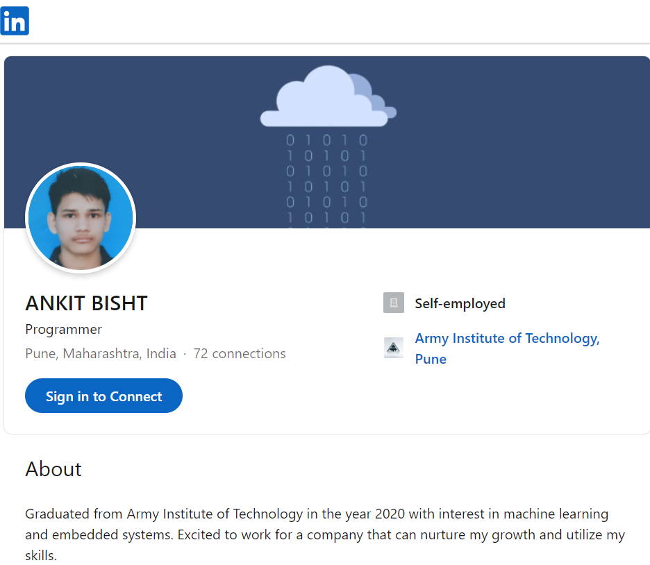

<!DOCTYPE html>
<html lang="en" dir="ltr">
  <head>

    <meta charset="utf-8">
    <!--Create a link for the default.css file-->
    <link rel="stylesheet" href="default.css">

    <link id="theme-style" rel="stylesheet" href="">

    <link rel="preconnect" href="https://fonts.gstatic.com">
    <link href="https://fonts.googleapis.com/css2?family=Russo+One&display=swap" rel="stylesheet">

    <link rel="preconnect" href="https://fonts.gstatic.com">
    <link href="https://fonts.googleapis.com/css2?family=Roboto+Mono:wght@500&family=Russo+One&display=swap" rel="stylesheet">

    <title>Ankit Bisht</title>
  </head>
  <body>

    <!--Create a section for the h1 tag-->
    <section class="s1">
      

        <!--Create a wrapper around h1 to form a grid and work on centering it-->
        

          <h1>Hi, I'm Ankit Bisht </h1>
        

        <!--Create wrapper for the nav, left-column, right-cloumn -->
        

          

            

              <!--create three div for the three dots, set diff id for each dot-->
              

              

              

            

            <ul id="navigation">
              <li>

                <a href="#">Contact</a>
              </li>
            </ul>
          

          

            
            <h5 style="text-align:center; line-height: 0;">Personalize Theme</h5>
            

              

              

              

              

            

            
*Theme setting will be saved for  your next visit.

          

          

            

            

              

              

              <h3>What I Do</h3>
              
Work with Java and Python to create
                Web/Machine Learning applications .

                

                

            

          

          

        

        <!--
This is a sentence

        <a href="#">Link</a>-->
      

    </section>

    <section class="s2">
      

        

          

            <h4>More About Me</h4>
            
I like to work on new projects mainly focused on
            Machine Learning and Web Development.
            

            
Coding and Debugging are my favorite part. I can
              speak a bit of Japanese and am interested in Japanese culture .
            

          

          <h4>TOP EXPERTISE</h4>
          
Fullstack developer with primary focus on React and
            Flask:<a target="_blank" href="resume ankit python.pdf">Download Resume</a>
          

          

            <ul>
              <li>Python</li>
              <li>Flask</li>
              <li>JavaScript</li>
              <li>React</li>
              <li>SQL</li>
            </ul>

            <ul>
              <li>OpenCV</li>
              <li>Tensorflow</li>
              <li>GCP</li>
              <li>Heroku</li>
              <li>HTML/CSS</li>
            </ul>
          

          

          

            
            <h3>Find me on Linkiden</h3>
            <a target="_blank" href="https:www.linkedin.com/in/ankit-bisht-4442b4186/">Linkiden:@ankitbisht</a>
          

        

      

    </section>

    <section class="s1">
      

        <h3 style="text-align: center;">Some of my past projects</h3>

          

          

            

              
              

                <h6 class="post-title">Blogspot</h6>
                
Created blog website using flask.
                   Check out my daily updates on my blog. 

                <a href="post.html">Read More</a>
              

            

        

          

            

              
              

                <h6 class="post-title">FB-Clone</h6>
                
Facebook clone with React.
                Try it out and feedback is much appreciated.

                <a href="#">Read More</a>
              

            

          

          

            

              
              

                <h6 class="post-title">Sentiment Analysis</h6>
                
Sentiment analysis of Imbd movie reviews to judge
                if review is positive or negative.

                <a target="_blank" href="https://github.com/41AnkitBisht/imgroot.git">Read More</a>
              

            

        

        

      

    </section>

    <section class="s2">
      

        <h3 style="text-align:center;" >Get In Touch</h3>
        <form id="contact-form">
          <label>Name</label>
          <input type="text" name="name" class="input-field">

          <label>Subject</label>
          <input type="text" name="subject" class="input-field">

          <label>Email</label>
          <input type="text" name="text" class="input-field">

          <label>Message</label>
          <textarea name="message" class="input-field" rows="8" cols="80"></textarea>

          <input id="submit-btn" type="submit" value="Send">
        </form>
      

    </section>

    

  </body>
</html>
